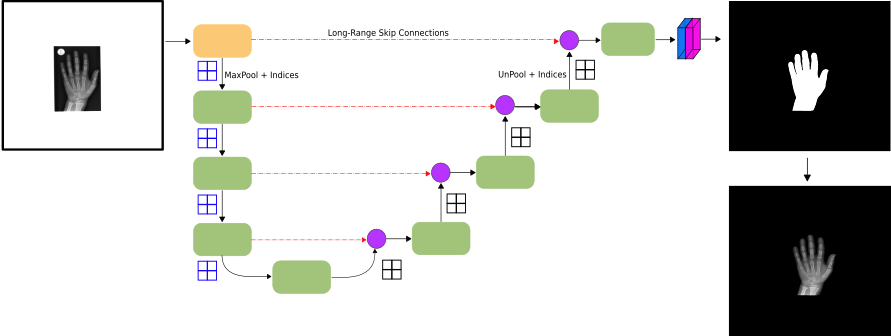

# RSNA Bone Age - Artifact and Confounder removal by Hand Segmentation

[](https://github.com/psf/black)
&nbsp; &nbsp; [](https://zenodo.org/records/7611677)
&nbsp; &nbsp; [](http://creativecommons.org/licenses/by-nc/4.0/)

Implementation of the masking module of [Deeplasia](https://doi.org/10.1007/s00247-023-05789-1).

This repository contains three Deep Learning approaches that segment hands in the [RSNA Pediatric Bone Age Dataset](https://www.kaggle.com/datasets/kmader/rsna-bone-age). It is intended to remove potential artifacts from scanning or department-specific which could disturb or bias downstream analysis or learning. In all models, an array of data augmentations was employed to cope with different challenges such as white border from scanning, boxes, and gradients, as well as inverted intensities, etc.

The ground truth data is available on [zenodo](https://zenodo.org/records/7611677). 

On a manually crafted test set within the RSNA training set, we achieve a DICE similarity score of $>0.99$.
The models were also qualitatively validated on the Los Angeles Digital Hand Atlas and private data sets:


## FastSurferCNN

The main model is a semantic segmentation model based on [*FastSurferCNN*](https://github.com/Deep-MI/FastSurfer) [(Henschel et al., 2020)](https://www.sciencedirect.com/science/article/pii/S1053811920304985).



The model is rather lightweight and, therefore, can run without GPU acceleration in almost real-time. The model was trained based on the predictions of the other models.


### Test models:

```bash
python FSCNN/predict.py \
    --checkpoint=/path/to/checkpoint.ckpt \
    --input=/path/to/input/ \
    --output=/path/to/target \
    --input_size=512 \
    --use_gpu
```

Hereby, the `input` can be either a whole directory containing the files or a single file.


### Train / fine tune:

```bash
python FSCNN/train_model.py \
    --train_path=/path/to/train/dataset \
    --val_path=/path/to/val/dataset \
    --size=512
```

The model training can be configured using the YML files in `FSCNN/configs`. Note, that the model will generate pre-computed/cached files containing the loss weights. Input images are expected to be encoded as RGBA, whereby the Alpha channel is the target mask and color information is ignored.

Per default, logs are saved to `run.log`.
To specify a different path, run the script with the `$LOG_FILE` environment variable:

``` bash
$ LOG_FILE=<path/to/log_file.txt> python train_model.py [...]
```

## Efficient-UNet

Here, another semantic segmentation [*Efficient-UNet*](https://github.com/pranshu97/effunet) model was used.

### Test models:

```bash
python UNet/predict.py \
    --model=/path/to/checkpoint.ckpt \
    --input=/path/to/input/ \
    --output=/path/to/target
    --input_size=512 \
    --use_gpu
```

### Train / fine tune:

```bash
python UNet/main.py
```
Check with the `--help` flag for training options.

## Tensormask

Here, an instance segmentation model implemented in [*Detectron2*](https://github.com/facebookresearch/detectron2/blob/main/projects/TensorMask/README.md) was used. Models were trained in Colab, so the requirements are specified there.


# Citation
```
@article{rassmann2023deeplasia,
  title={Deeplasia: deep learning for bone age assessment validated on skeletal dysplasias},
  author={Rassmann, Sebastian and Keller, Alexandra and Skaf, Kyra and Hustinx, Alexander and Gausche, Ruth and Ibarra-Arrelano, Miguel A and Hsieh, Tzung-Chien and Madajieu, Yolande ED and N{\"o}then, Markus M and Pf{\"a}ffle, Roland and others},
  journal={Pediatric Radiology},
  pages={1--14},
  year={2023},
  publisher={Springer}
}
```

